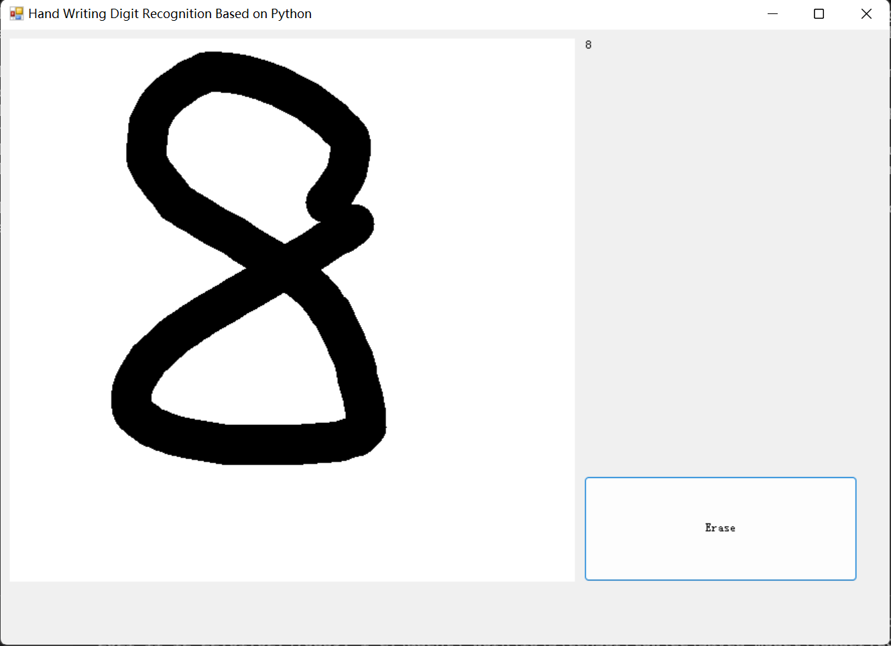
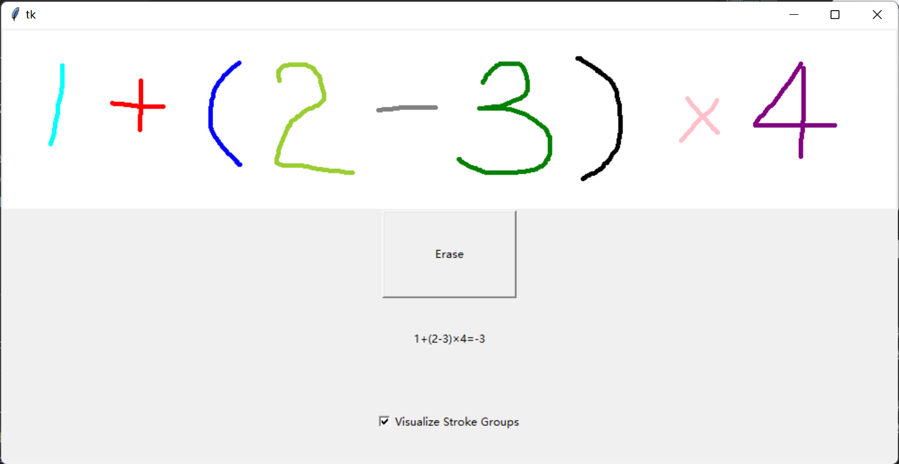

# mnist-calculator

## 运行方法

> 如果已经安装依赖，直接克隆本存储库。否则按照下面的方式克隆：
> ```cmd
> git clone --recursive https://github.com/LogCreative/mnist-calculator.git
> ```
> 运行环境：
> - **任务 1** Windows (x64)，含有 .NET Framework 4.6.1
> - **任务 2** Python 3.6.6，已运行 [samples-for-ai](samples-for-ai/installer/install.py) 安装依赖库以及 pythonnet：
> ```cmd
> cd pythonnet
> pip install .
> ```
> - **任务 3** 需要安装 tkinter
> ```cmd
> pip install tkinter
> ```
### 任务 1

直接运行构建完成的程序（或者运行根目录下的快捷方式打开）：
- [task1/B09/src/MNIST.App/bin/x64/Release/MNIST.App.exe](task1/B07/src/MNIST.App/bin/x64/Release/MNIST.App.exe)

- [task1/B09/src/MNIST.App/bin/x64/Release/MNIST.App.exe](task1/B09/src/MNIST.App/bin/x64/Release/MNIST.App.exe)

### 任务 2

```cmd
cd task2/MnistPython
python MnistPython.py
```


### 任务 3

```cmd
cd task3
python main.py
```


## 原理概要

### 任务 1

按照文档要求，先训练模型，然后在 Visual Studio 2017 中安装 AI Tools for VS，快速集成模型。训练扩展模型时，需要先将开源的 [吴沛钢的数据](https://blog.csdn.net/qq_34919953/article/details/81048259) 放入根目录 `input/extension` 文件夹中再训练，将文件夹名改为 `add`, `minus`, `mul`, `div`, `lp`, `rp`。

### 任务 2

在 python 中通过 pythonnet 调用 .NET Framework 中的 dll 库以生成界面、调用已经处理好的 Model.dll。

### 任务 3

使用 tkinter 的 Canvas 捕捉鼠标动作，在每次需要识别计算时，将每一个分组笔画在内存的 PIL 图形中重绘，缩放为 28x28 大小的图片后喂入训练好的模型函数中以获得识别结果。计算采用了双栈结构，以计算多位整数，并设计了[单元测试](task3/calctest.py)。